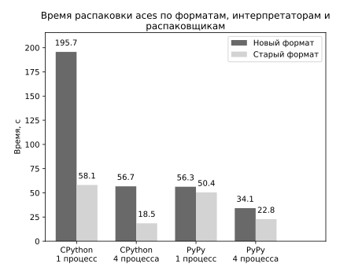

# Вспомогательный инcтрументарий для работы с файлами конфигурации.

## Среда выполнения

Linux, Рython 3.7 для совместимости с PyPy3.

# Установка

```pip install .```

## Режим распаковки текстов

Демонстрационные скрипты находятся в проекте `wt-tools`. Они основаны на `blk_unpacker.py` проекта `wt-tools` и реализуют 
подобный интерфейс командной строки с форматами `strict_blk`, `json`, `json_2`, `json_3`.

Оценка времени распаковки aces.vromfs.bin_u новой и старой версии из директории в памяти для CPython и PyPy на 
Core i5-4670.

`blk_unpack_ng.py` с одним процессом.\
`blk_unpack_ng_mp.py` с числом процессов по количеству ядер.



### Выходные форматы

#### strict_blk

Результат обхода секции в глубину с сохранением типов. Для форматов `json*` потребуется схема для полного
восстановления секции.

```
// single_map-strict_blk.txt

a:i=1
b:i=2
c:i=3

sub{
  x:r=4.0
  y:r=5.0
}
```

```
// multi_map-strict_blk.txt

a:i=1
a:i=2
b:i=3

sub{
  x:r=4.0
  y:r=5.0
}
```

#### json

Подходит для секций, в которых мультизначение состоит из одного значения. 
Иначе контейнер из словаря превратится в список словарей на уровне мультизначения.

```json5
// single_map-json.json

{
  "a": 1,
  "b": 2,
  "c": 3,
  "sub": {
    "x": 4.0,
    "y": 5.0
  }
}
```

```json5
// multi_map-json.json

[
  {
    "a": 1
  },
  {
    "a": 2
  },
  {
    "b": 3
  },
  {
    "sub": {
      "x": 4.0,
      "y": 5.0
    }
  }
]
```

#### json_2

Каждое мультизначение представлено списком значений.

```json5
// single_map-json_2.json

{
  "a": [
    1
  ],
  "b": [
    2
  ],
  "c": [
    3
  ],
  "sub": [
    {
      "x": [
        4.0
      ],
      "y": [
        5.0
      ]
    }
  ]
}
```

```json5
// multi_map-json_2.json

{
  "a": [
    1,
    2
  ],
  "b": [
    3
  ],
  "sub": [
    {
      "x": [
        4.0
      ],
      "y": [
        5.0
      ]
    }
  ]
}
```

#### json_3

Мультизначение с одним значением представлено одним значением. 
Мультизначение с несколькими значениями представлено списком значений.

```json5
// single_map-json_3.json

{
  "a": 1,
  "b": 2,
  "c": 3,
  "sub": {
    "x": 4.0,
    "y": 5.0
  }
}
```

```json5
// multi_map-json_3.json

{
  "a": [
    1,
    2
  ],
  "b": 3,
  "sub": {
    "x": 4.0,
    "y": 5.0
  }
}
```

**ВНИМАНИЕ**

Инструмент основан на представлении секции как `{name: [values]}`. Секция запоминает порядок только первого 
значения при добавлении `(name, value)` пары:

```
[(a, x), (b, y), (a, z)] -> {a: [x, z], b: [y]}
```

```
a -> x
a -> z
b -> y
```

Это может повлечь разрастание разности текстовых файлов, если вы прежде использовали в своих архивах распаковщик, 
основанный на представлении секции как `[(name, value)]`, способной запоминать порядок всех пар при добавлении

```
a -> x
b -> y
a -> z
```

Тестирование
------------

Настраиваемые директории в `pytest.ini`

* `currespath` директория с файлами `blk` текущего формата
* `bbfrespath` директория с файлами `blk` формата bbf3
* `cdkpath` директория CDK с текстовыми файлами
* `buildpath` выходная директория тестов

После настройки одноименные фикстуры для `pytest`содержат указанные пути. 
